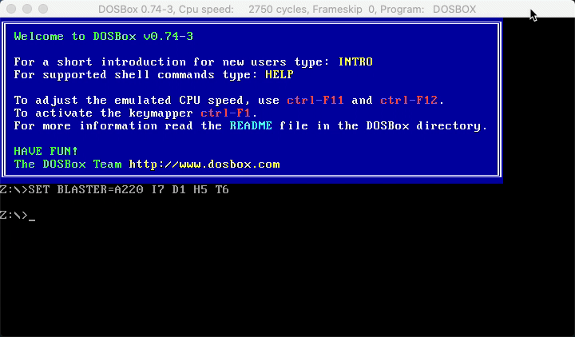

# Intcode for 16-bit DOS (Intel 8086)

_Intcode_ is the fictional machine language from [Advent Of Code
2019](https://adventofcode.com/2019).

This repository contains some experiments for implementing an interpreter for
Intcode on the Intel 8086 CPU under DOS.

This project is a port of [Intcode for Commodore 64](https://github.com/tkoster/intcode-commodore64).

8086 wizards will surely spot many inefficiencies that could be improved 😅

## Current Status

Part 1 of day 2 is implemented. Loading the program will load the interpreter
and _gravity assist program_ into memory, execute the Intcode program and print the output (in hexadecimal).



The hexadecimal number `007a54b4` equals `8017076` in decimal which is the answer to my puzzle input, which was:

```
1,12,2,3,1,1,2,3,1,3,4,3,1,5,0,3,2,10,1,19,1,6,19,23,2,23,6,27,1,5,27,31,1,31,9,35,2,10,35,39,1,5,39,43,2,43,10,47,1,47,6,51,2,51,6,55,2,55,13,59,2,6,59,63,1,63,5,67,1,6,67,71,2,71,9,75,1,6,75,79,2,13,79,83,1,9,83,87,1,87,13,91,2,91,10,95,1,6,95,99,1,99,13,103,1,13,103,107,2,107,10,111,1,9,111,115,1,115,10,119,1,5,119,123,1,6,123,127,1,10,127,131,1,2,131,135,1,135,10,0,99,2,14,0,0
```

## Compiling

You will need:

- [The Netwide Assembler (NASM)](https://www.nasm.us)
- [DOSBox emulator](https://dosbox.com)

The Makefile produces a 16-bit DOS COM executable file. The executable is built directly by nasm on your host (not in DOS), without the need for a separate DOS linker. This limits the program to 64KB of memory, but that is more than adequate for the day 2 task.

Run `make` to build the executable file `day2p1.com`.

```
$ make
```

## Running

The program executable file can be launched directly in DOSBox. The accomanying configuration file `misc/dosbox.conf` specifies a slowish CPU (approx 10 MHz) and 1MB of memory for the emulated machine, although the default DOSBox configuration also works perfectly well.

```
$ dosbox -conf misc/dosbox.conf day2p1.com
```
